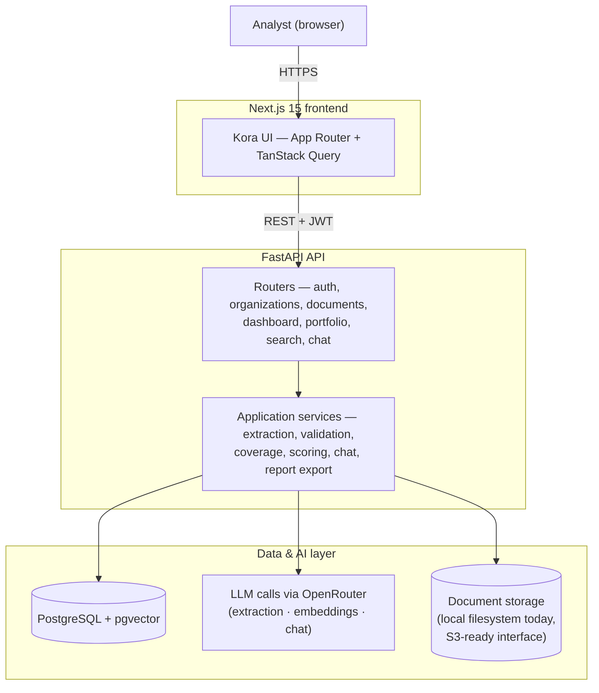
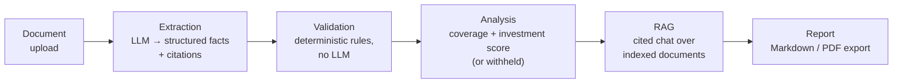

# Kora — Architecture

A short, interview-friendly walkthrough of how Kora is put together. For exhaustive endpoint-by-endpoint detail, see [`backend/README.md`](../backend/README.md); this document is a map, not a reference.

## System diagram

- **Next.js frontend** — the entire UI, talking to the backend exclusively through a typed API client. Holds no business logic or sample data of its own; every number on screen came from a backend response.
- **FastAPI API** — routers handle HTTP concerns (auth, validation, response shaping) and delegate everything else to `app/services/`.
- **Application services** — one service per concern (extraction, validation, coverage, investment scoring, chat, report export, etc.). This is where the actual product logic lives, independent of the HTTP layer, and the layer `pytest` exercises directly.
- **PostgreSQL + pgvector** — the single system of record, and also the vector store for document-chunk embeddings (semantic search / RAG), so there's no separate vector database to keep in sync.
- **LLM processing via OpenRouter** — every model call (extraction, embeddings, chat) goes through OpenRouter's OpenAI-compatible API, so the backend talks to one abstraction rather than being coupled to a single model provider.
- **Document storage** — uploaded files are currently stored on the local filesystem behind a `StorageService` interface (`app/core/storage.py`) written specifically so a future S3-compatible backend can be swapped in without touching any calling code.

## Product workflow

This is the same workflow the product README describes, mapped onto the actual pipeline stages:

| Stage | What happens | Where |
|---|---|---|
| Document | Upload, text extraction (PDF/DOCX/TXT), and optional indexing into chunk embeddings for chat | `document_processor`, `document_service`, `document_index_service`, `chunking_service`, `embedding_service` |
| Extraction | LLM extracts structured financial facts and qualitative facts, each with a source citation | `ai_service`, `financial_analysis_service`, `evidence_service` |
| Validation | Deterministic, non-LLM rule checks over the extracted facts | `validation_service` (200+ unit tests) |
| Analysis | Due-diligence coverage scoring against a fixed checklist; category-weighted investment score, withheld below a coverage threshold | `coverage_service`, `missing_information_service`, `investment_scoring_service` |
| RAG (Ask) | Retrieval-augmented chat grounded in indexed chunks, with citations; an "analytical" mode adds tool-calling over the extracted data | `chat_service`, `chat_v2_service`, `chat_tools` |
| Report | Narrative and evidence-grounded due-diligence report generation, exportable as Markdown/PDF | `due_diligence_service`, `due_diligence_v2_service`, `report_export_service` |

## Data model, in brief

Everything hangs off two roots: `organizations` (a workspace, with role-based `memberships`) and `documents` (one uploaded file per company profile). From a document, the pipeline produces `document_analyses` (qualitative facts), `financial_facts` (cited, time-series-capable financial data points), `financial_metrics` (computed summary KPIs), `validation_findings` and `coverage_assessments` / `missing_information_items` (the deterministic layer), `investment_scores`, and `document_embeddings` (pgvector, for chat/search). Every table that stores an AI-derived claim keeps enough structure to answer "where did this come from" without a follow-up query — that traceability is a deliberate, cross-cutting design choice, not just a feature of one screen.

## Deployment

`docker-compose.production.yml` runs the two backend-side pieces — a `pgvector/pgvector` PostgreSQL container and the FastAPI app — behind an internal Docker network, with the FastAPI container's port published to the host. The frontend is deployed independently (a standard Next.js build/start). This is a deliberately simple, single-instance setup: no read replicas, no background job queue, no separate vector database — appropriate for the project's current stage, with the storage and LLM-provider abstractions in place so the pieces most likely to need swapping (object storage, model provider) can change without a rewrite.
